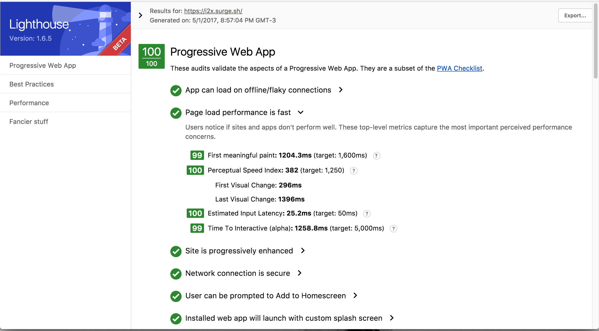
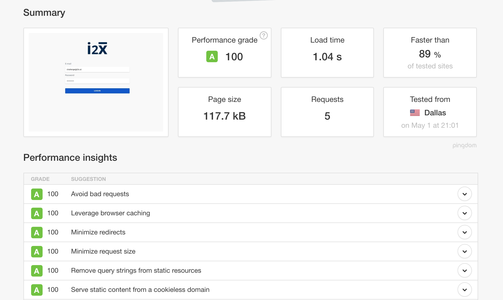
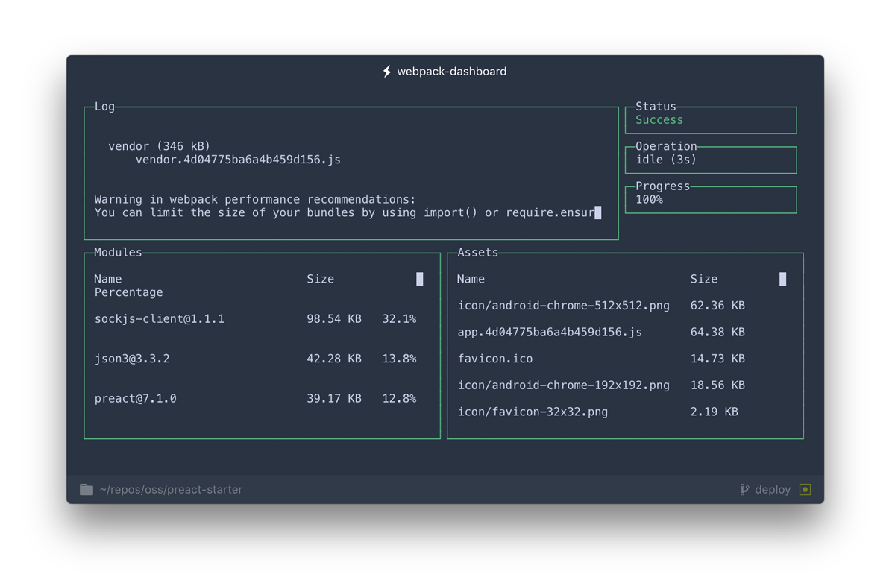

# I2X-starter
> I2X challenge: progressive web app made with preact  [live demo](https://i2x.surge.sh/)

---

# bundle sizes & performance
```
Bundle Size:            64.4 kB  | Gzip size 20.3 kB Gzipped
pagespeed:              100
lighthouse:             100
```

# Guide
- [Motivation](#motivation)
- [Installation](#install)
- [Development Workflow](#Development)
- [Folder Structure](#structure)

# Stack
- [Preact](https://preactjs.com/)
- [MomentJS](https://momentjs.com/)
- [Webpack-2](https://webpack.js.org/)
- [sw-precache](https://github.com/GoogleChrome/sw-precache)

# Features
* SASS & Autoprefixer
* Offline Caching (via `serviceWorker`)
* Asset Versioning (aka "cache-busting")
* ES2015 (ES6) and ES2016 (ES7) support
* Webpack Bundle Analysis (see [dashboard](#dashboard))
* Hot Module Replacement (HMR) for all files
* Preact's [Developer Tools](#preact-developer-tools)
* [Lighthouse](https://github.com/GoogleChrome/lighthouse) certified!

# PWA
Progressive Web Apps are installable and live on the user's home screen, without the need for an app store. They offer an immersive full screen experience with help from a web app manifest file when a number of criteria have been met:

- The app uses a service worker
- The site is using HTTPS
- The app has a manifest declared
- The manifest has a short_name, 144 pixel icon and a type of 'image/png'

- [App install example](https://vimeo.com/215742817)


When launched from the user’s home screen, service workers enable a Progressive Web App to load instantly, regardless of the network state.

A service worker, written in JavaScript, is like a client-side proxy and puts you in control of the cache and how to respond to resource requests. By pre-caching key resources you can eliminate the dependence on the network, ensuring an instant and reliable experience for your users.

- [App runing offline example](https://vimeo.com/215742765)


# Motivation

### why progressive webapp ?

Progressive Web Apps are user experiences that have the reach of the web, and are:
Reliable - Load instantly and never show the downasaur, even in uncertain network conditions.
Fast - Respond quickly to user interactions with silky smooth animations and no janky scrolling.
Engaging - Feel like a natural app on the device, with an immersive user experience.
This new level of quality allows Progressive Web Apps to earn a place on the user's home screen.

**Google** has been collecting PWA case studies and the results are pretty impressive.

**Alibaba** is the global leader in B2B trade. Recently, they upgraded to a PWA:
  - 76% more web conversions
  - 30% more monthly active users on Android, 14% more on iOS
  - 4X higher interaction rate from Add to Homescreen

**Housing.com** is one of the leading real estate platforms in India. After implementing their PWA:
- 38% more conversions
- 40% lower bounce rate
- 10% longer average session
- 30% faster page load

for more really awesome examples see [pwastats](https://www.pwastats.com/)


## Install

```sh
git clone https://github.com/vitormalencar/i2x
cd i2x
npm install
npm run build
npm start
```

> :exclamation: Use [Yarn](https://yarnpkg.com/) to install dependencies 3x faster than NPM!


## Development

### Commands

Any of the following commands can be run from the command line.

> If using [Yarn](https://yarnpkg.com/), all instances of `npm` can be replaced with `yarn`

#### build

```
$ npm run build
```

Compiles all files. Output is sent to the `dist` directory.

#### start

```
$ npm start
```

Runs your application (from the `dist` directory) in the browser.

#### dev

```
$ npm run dev
```

Like [`start`](#start), but will auto-compile & auto-reload the server after any file changes within the `src` directory.

# Speed tests
 

 

### Dashboard

With [`webpack-dashboard`](https://github.com/FormidableLabs/webpack-dashboard), it's much easier to see what's happening inside your bundles. In addition to de-cluttering your `webpack-dev-server` log, you can quickly make sense of your bundles' `import`s and sizes.



The dashboard is meant to be interactive (scrollable). If you are having issues, please see the author's note:

> ***OS X Terminal.app users:*** Make sure that **View → Allow Mouse Reporting** is enabled, otherwise scrolling through logs and modules won't work. If your version of Terminal.app doesn't have this feature, you may want to check out an alternative such as [iTerm2](https://www.iterm2.com/index.html).

### Preact Developer Tools

You can inspect and modify the state of your Preact UI components at runtime using the [React Developer Tools](https://github.com/facebook/react-devtools) browser extension.

1. Install the [React Developer Tools](https://github.com/facebook/react-devtools) extension
2. [Import the `preact/devtools`](src/index.js#L21) module in your app
3. Reload and go to the 'React' tab in the browser's development tools

## License

MIT © [Vitor Alencar](https://vitormalencar.com)
